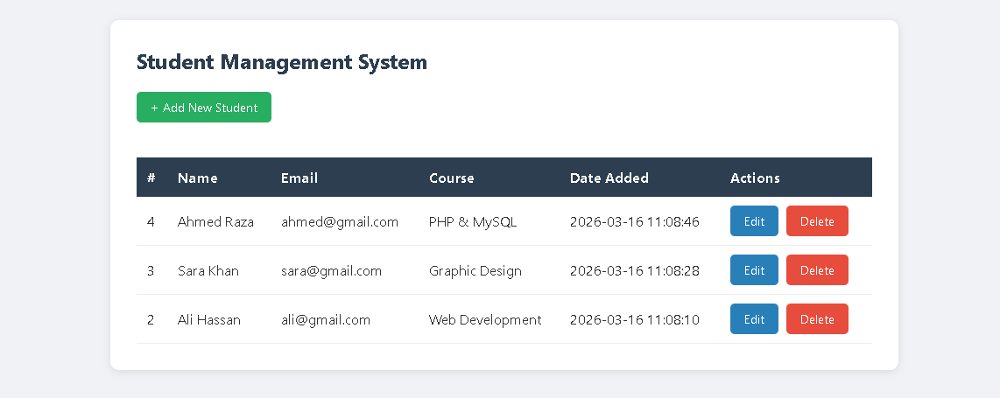

# Student Management System

A simple Student Management System built with PHP and MySQL.

## Features
- Add new students
- View all students
- Edit student details
- Delete students
- Form validation & error handling
- Secure prepared statements (SQL injection protection)

## Tech Stack
- PHP
- MySQL
- HTML/CSS

## Setup Instructions
1. Clone this repository
2. Run this SQL in phpMyAdmin to create the database:

CREATE DATABASE student_db;
USE student_db;
CREATE TABLE students (
    id INT AUTO_INCREMENT PRIMARY KEY,
    name VARCHAR(100) NOT NULL,
    email VARCHAR(100) NOT NULL,
    course VARCHAR(100) NOT NULL,
    created_at TIMESTAMP DEFAULT CURRENT_TIMESTAMP
);

3. Create a db.php file in the root folder with your database credentials
4. Run on localhost using XAMPP

## Screenshot
