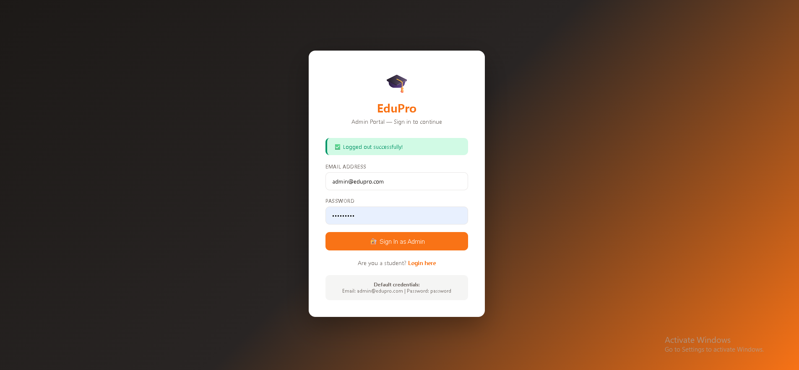
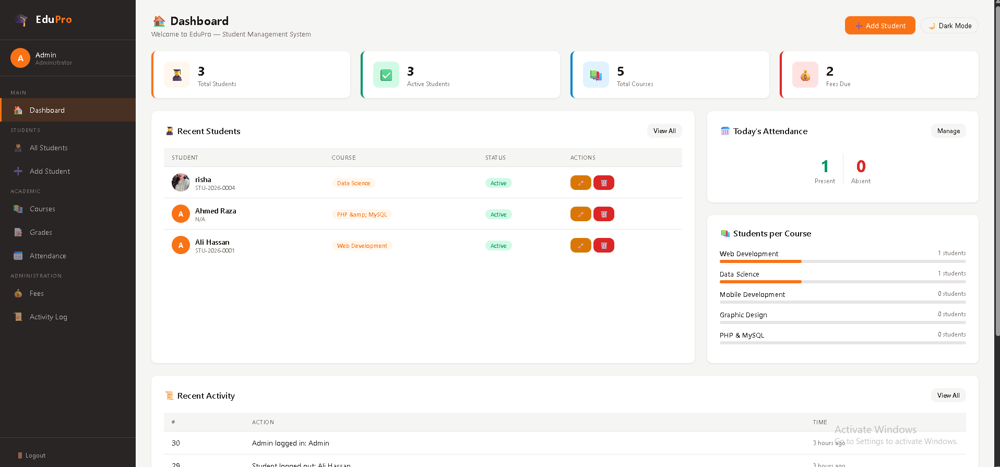
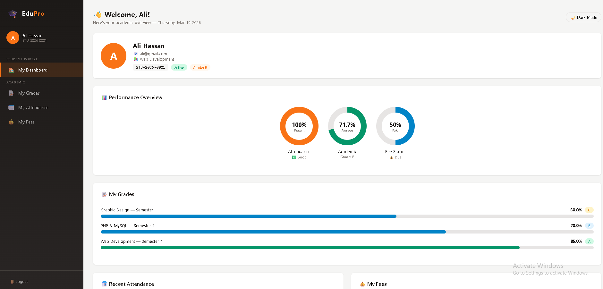
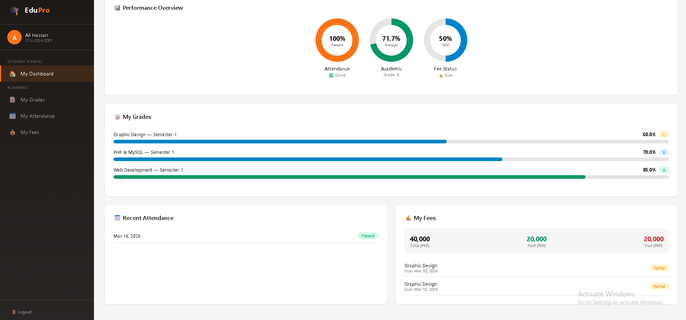

# 🎓 EduPro — Student Management System


A fully-featured, professional Learning Management System (LMS) built with pure PHP and MySQL — no frameworks. Designed to demonstrate real-world web development skills including authentication, role-based access, performance tracking, and clean UI/UX design.

---

## 🌟 Features

### 🔐 Authentication
- Admin Login with secure session handling
- Student Login with Student ID + password
- Role-based access control
- Protected routes per role
- Separate dashboards for Admin and Student

### 👨‍🎓 Student Management
- Add, Edit, and Delete students
- Auto-generated Student ID 
- Profile photo upload
- Student status (Active/Inactive/Graduated)
- Search by name, email, or Student ID
- Filter by status and course
- Pagination (10 per page)
- Bulk delete
- Export to CSV
- Print support

### 📚 Academic Management
- Course management (Add/Delete)
- Grade management with auto grade calculation
- Attendance tracking (Present/Absent/Late)
- Mark all present/absent with one click
- Attendance history per student

### 💰 Fee Management
- Add fee records per student
- Track paid and due amounts
- Mark as paid with one click
- Fee status (Paid/Unpaid/Partial)
- Fee summary per student

### 📊 Performance Tracking
- Circular progress charts (Attendance, Grades, Fees)
- Grade bar charts per course
- Attendance breakdown chart
- Overall GPA calculation
- Performance overview per student

### 🎨 UI/UX
- Orange & Dark professional theme
- Dark / Light mode toggle
- Fully responsive (mobile, tablet, desktop)
- Hamburger menu on mobile
- Student profile page with full performance data
- Activity log for all system actions

---

## 🛠️ Tech Stack

| Technology | Usage |
|------------|-------|
| PHP 8.2 | Backend logic, sessions, authentication |
| MySQL | Database with foreign keys & relationships |
| HTML5 | Structure and semantic markup |
| CSS3 | Custom styling, charts, dark mode |

---

## 👥 User Roles

| Role | Access |
|------|--------|
| **Admin** | Full system access — manage students, grades, attendance, fees |
| **Student** | Personal dashboard — view own grades, attendance, fees |

---

## 📁 Project Structure
```
student-management-system/
├── config.php              # App config & helper functions
├── login.php               # Admin login
├── logout.php              # Admin logout
├── dashboard.php           # Admin dashboard
├── students.php            # Student list with search & filter
├── add.php                 # Add student
├── edit.php                # Edit student
├── delete.php              # Delete student
├── profile.php             # Student profile with charts
├── courses.php             # Course management
├── grades.php              # Grade management
├── attendance.php          # Attendance tracking
├── fees.php                # Fee management
├── activity.php            # Activity log
├── student/
│   ├── login.php           # Student login
│   ├── logout.php          # Student logout
│   └── dashboard.php       # Student dashboard with charts
├── includes/
│   ├── header.php          # Reusable header
│   ├── sidebar.php         # Admin sidebar
│   └── footer.php          # JS & scripts
├── assets/
│   └── style.css           # Complete stylesheet
└── uploads/
    └── students/           # Student profile images
```

---

## ⚙️ Installation

### Prerequisites
- XAMPP (Apache + MySQL + PHP 8.x)

### Steps

**1. Clone the repository**
```bash
git clone https://github.com/sn123686-dev/student-management-system.git
cd student-management-system
```

**2. Create the database**

Open phpMyAdmin and run:
```sql
CREATE DATABASE student_db;
USE student_db;

CREATE TABLE students (
    id INT AUTO_INCREMENT PRIMARY KEY,
    student_id VARCHAR(20) UNIQUE,
    name VARCHAR(100) NOT NULL,
    email VARCHAR(100) NOT NULL UNIQUE,
    password VARCHAR(255) NULL,
    phone VARCHAR(20),
    address TEXT,
    profile_image VARCHAR(255) NULL,
    status ENUM('active','inactive','graduated') DEFAULT 'active',
    date_of_birth DATE NULL,
    gender ENUM('male','female','other') NULL,
    course VARCHAR(100) NOT NULL,
    last_login DATETIME NULL,
    created_at TIMESTAMP DEFAULT CURRENT_TIMESTAMP
);

CREATE TABLE courses (
    id INT AUTO_INCREMENT PRIMARY KEY,
    name VARCHAR(100) NOT NULL UNIQUE,
    code VARCHAR(20) UNIQUE,
    description TEXT,
    created_at TIMESTAMP DEFAULT CURRENT_TIMESTAMP
);

CREATE TABLE grades (
    id INT AUTO_INCREMENT PRIMARY KEY,
    student_id INT NOT NULL,
    course_id INT NOT NULL,
    marks DECIMAL(5,2) NOT NULL,
    grade VARCHAR(5),
    semester VARCHAR(20),
    created_at TIMESTAMP DEFAULT CURRENT_TIMESTAMP,
    FOREIGN KEY (student_id) REFERENCES students(id) ON DELETE CASCADE,
    FOREIGN KEY (course_id) REFERENCES courses(id) ON DELETE CASCADE
);

CREATE TABLE attendance (
    id INT AUTO_INCREMENT PRIMARY KEY,
    student_id INT NOT NULL,
    date DATE NOT NULL,
    status ENUM('present','absent','late') NOT NULL,
    created_at TIMESTAMP DEFAULT CURRENT_TIMESTAMP,
    FOREIGN KEY (student_id) REFERENCES students(id) ON DELETE CASCADE
);

CREATE TABLE fees (
    id INT AUTO_INCREMENT PRIMARY KEY,
    student_id INT NOT NULL,
    amount DECIMAL(10,2) NOT NULL,
    paid_amount DECIMAL(10,2) DEFAULT 0,
    due_date DATE,
    status ENUM('paid','unpaid','partial') DEFAULT 'unpaid',
    description VARCHAR(255),
    created_at TIMESTAMP DEFAULT CURRENT_TIMESTAMP,
    FOREIGN KEY (student_id) REFERENCES students(id) ON DELETE CASCADE
);

CREATE TABLE activity_log (
    id INT AUTO_INCREMENT PRIMARY KEY,
    action VARCHAR(255) NOT NULL,
    created_at TIMESTAMP DEFAULT CURRENT_TIMESTAMP
);

CREATE TABLE admins (
    id INT AUTO_INCREMENT PRIMARY KEY,
    name VARCHAR(100) NOT NULL,
    email VARCHAR(100) NOT NULL UNIQUE,
    password VARCHAR(255) NOT NULL,
    created_at TIMESTAMP DEFAULT CURRENT_TIMESTAMP
);

INSERT INTO admins (name, email, password) VALUES (
    'Admin',
    'admin@edupro.com',
    '$2y$10$92IXUNpkjO0rOQ5byMi.Ye4oKoEa3Ro9llC/.og/at2.uheWG/igi'
);
```

**3. Create config file**

Create `config.php` with your database credentials.

**4. Create uploads folder**
```bash
mkdir uploads/students
```

**5. Visit the app**
```
http://localhost/student-management-system/login.php
```

**6. Default Admin Credentials**
- Email: `admin@edupro.com`
- Password: `password`

---

## 📸 Screenshots

### Admin Login


### Admin Dashboard


### Student Profile with Charts


### Student Dashboard


### Mobile View


---

## 👩‍💻 Author

**Saima Nadeem**
- GitHub: [@sn123686-dev](https://github.com/sn123686-dev)
- Location: Islamabad, Pakistan

---

## 📄 License

This project is open source and available under the [MIT License](LICENSE).
